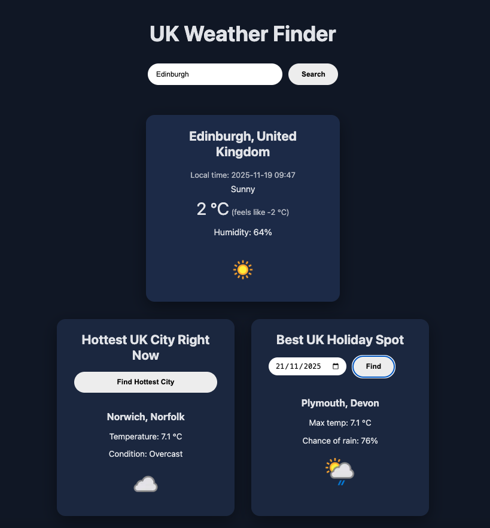

  <h1>Containerised Weather Application! 👋  </h1>
  <h3>Extension of mthree group project, where now it can be Dockerised!​</h3>
  

### 🚀 Key Info:
- docker.yml workflow file builds a Docker Image and pushes to Docker Hub, where a Docker Container can then be run from
- back-end uses a weather API (https://www.weatherapi.com/) to fetch data therefore WEATHER_API_KEY must be added as an environment variable when running the container
- S3-React.yml workflow file builds and deploys the front-end React application to an AWS S3 bucket

### ☑️ Repo Secrets Checklist:
- WEATHER_API_KEY
- DOCKER_HUB_USERNAME
- DOCKER_HUB_PASSWORD
- AWS_ACCESS_KEY_ID
- AWS_SECRET_ACCESS_KEY
- AWS_REGION
- S3_BUCKET_NAME

### 👩‍💻 Tech Stack:
Docker | Python | React(JavaScript, CSS, HTML) | Git
